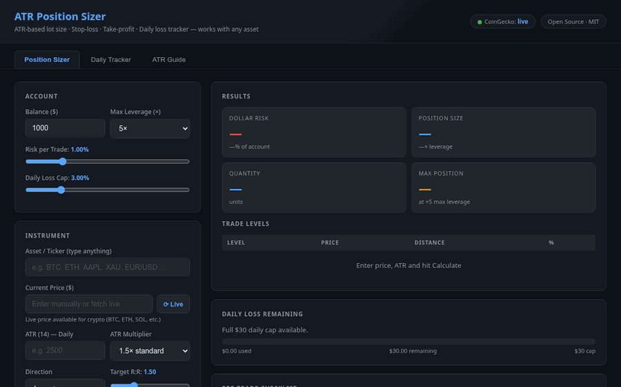

# ATR Position Sizer

> Free, open-source position sizing calculator for traders — works with any asset, runs entirely in your browser.

[](https://dirtdemon31.github.io/atr-position-sizer/)
[](LICENSE)
[](https://dirtdemon31.github.io/atr-position-sizer/)

---



---

## What It Does

Instead of guessing lot sizes or using arbitrary percentage stops, this tool calculates your exact position size from **ATR (Average True Range)** — so your stop-loss is always proportional to current market volatility, not a fixed number you made up.

Enter your account balance, risk %, the asset's ATR from your chart, and a multiplier — the sizer outputs your exact:

- **Stop-loss price** anchored to real volatility
- **Take-profit price** at your chosen R:R ratio  
- **Lot size** (units) so one stop-out = exactly your risk amount  
- **Dollar risk** and **leverage used** vs your max limit
- **Daily cap remaining** so you know when to stop

---

## Live Demo

👉 **[dirtdemon31.github.io/atr-position-sizer](https://dirtdemon31.github.io/atr-position-sizer/)**

No installation. No sign-up. Open and use.

---

## Features

| Tab | What's Inside |
|---|---|
| **Position Sizer** | Core calculator — lot size, stop price, TP price, leverage check, pre-trade checklist |
| **Daily Tracker** | Log each trade, track running P&L, live daily-cap progress bar |
| **ATR Guide** | Multiplier selection guide, step-by-step workflow, common mistakes |

### Highlights

- Works with **any asset** — crypto, stocks, forex, commodities, indices — type any ticker
- **Live price fetch** for 50+ crypto tickers via CoinGecko (no API key needed)
- **Pre-trade checklist** auto-validates R:R, leverage limit, daily cap, and inputs
- **Zero dependencies** — one HTML file, no build step, no server
- **No data collected** — everything stays in your browser session

---

## Quick Start

### Use Online
Open the [live demo](https://dirtdemon31.github.io/atr-position-sizer/) in any browser.

### Run Locally
```bash
git clone https://github.com/DirtDemon31/atr-position-sizer.git
cd atr-position-sizer
```

Then open `index.html` in your browser:

| OS | Command |
|---|---|
| Linux | `xdg-open index.html` |
| macOS | `open index.html` |
| Windows | `start index.html` |

Or simply drag `index.html` into an open browser window. The address bar should show `file:///...` — that confirms it's running locally.

---

## Input Reference

| Field | What to Enter | Example |
|---|---|---|
| **Balance ($)** | Your total account equity | `5000` |
| **Max Leverage** | Maximum leverage your broker allows | `5×` |
| **Risk per Trade** | % of account you're willing to lose on one trade | `1%` = $50 on a $5K account |
| **Daily Loss Cap** | Maximum % you'll lose in one session before stopping | `3%` = $150 on $5K |
| **Asset / Ticker** | Any symbol — type freely | `BTC`, `AAPL`, `EUR/USD`, `XAU` |
| **Current Price** | Asset price in USD — enter manually or click ⟳ Live | `84500` |
| **ATR (14)** | ATR(14) value from your daily chart | `2800` for BTC |
| **ATR Multiplier** | How many ATRs your stop sits from entry | `1.5×` standard |
| **Direction** | Long (buy) or Short (sell) | `Long` |
| **Target R:R** | Take-profit distance as a multiple of stop distance | `1.5` = TP is 1.5× the stop |
| **Today's P&L** | Running loss so far today (negative if losing) | `-75.00` |

### Where to Find ATR(14)

Open your daily chart in **TradingView**, **Binance**, or any charting platform and add the **ATR indicator** with period 14. The value shown is in price units — paste it directly into the sizer.

> Example: BTC daily chart shows ATR = **$2,840** → enter `2840`

---

## ATR Multiplier Guide

The multiplier controls how far your stop sits from the entry relative to recent volatility. Wider multiplier = fewer false stop-outs, but larger loss per trade (offset by smaller position size).

| Multiplier | Market Condition | When to Use |
|---|---|---|
| **1.0×** | Very low volatility | Tight ranges, no momentum |
| **1.5×** | Normal trending market | Default for most setups ✓ |
| **2.0×** | Elevated volatility | Post-news, wide daily candles |
| **2.5×** | High volatility | Macro events, strong trends |
| **3.0×** | Extreme volatility | FOMC, CPI, earnings, black swan |

**Rule of thumb:** When in doubt, use 1.5×. If you're getting stopped out frequently on valid setups, increase to 2×. Never widen the multiplier just because you don't want to take a loss — that defeats the purpose.

---

## The Formula

```
Stop Distance  = ATR(14) × Multiplier
Stop Price     = Entry − Stop Distance        ← Long
Stop Price     = Entry + Stop Distance        ← Short

TP Price       = Entry + (Stop Distance × R:R)  ← Long
TP Price       = Entry − (Stop Distance × R:R)  ← Short

Quantity       = Dollar Risk ÷ Stop Distance
Position Size  = Quantity × Entry Price
Leverage Used  = Position Size ÷ Account Balance
Dollar Risk    = Account Balance × Risk %
```

**Example — BTC Long:**
```
Balance:        $5,000
Risk:           1% = $50
Entry:          $84,500
ATR(14):        $2,800
Multiplier:     1.5×
Stop Distance:  $2,800 × 1.5 = $4,200
Stop Price:     $84,500 − $4,200 = $80,300
Quantity:       $50 ÷ $4,200 = 0.0119 BTC
Position Size:  0.0119 × $84,500 = $1,005.55
Leverage Used:  $1,005.55 ÷ $5,000 = 0.20×   (well within 5× limit)
TP (at 1.5R):  $84,500 + $6,300 = $90,800
Max Win:        $50 × 1.5 = $75
```

---

## Why ATR Stops Beat Fixed % Stops

| Fixed % Stop | ATR Stop |
|---|---|
| Same stop every trade regardless of conditions | Stop scales with current volatility |
| Too tight in high-vol → random stop-outs | Fits the market's natural noise range |
| Too wide in low-vol → oversized losses | Position size adjusts to keep risk constant |
| Arbitrary — not anchored to price structure | Can be anchored to swing high/low |

The core insight: **risk stays constant in dollars — only position size changes**. High ATR day = smaller position. Low ATR day = larger position. Your dollar loss per stop-out is always exactly your risk %.

---

## Live Price Support (Crypto)

Click the **⟳ Live** button to fetch the current price from [CoinGecko](https://www.coingecko.com) — no API key required.

<details>
<summary>Supported crypto tickers (click to expand)</summary>

`BTC` `ETH` `SOL` `XRP` `BNB` `ADA` `DOGE` `DOT` `MATIC` `LINK` `LTC` `AVAX` `UNI` `ATOM` `XLM` `ALGO` `TON` `NEAR` `OP` `ARB` `INJ` `SUI` `APT` `SEI` `TIA` `TRUMP` `PEPE` `WIF` `BONK` `SHIB` `FLOKI` `ZEC` `DASH` `XMR` `FIL` `SAND` `MANA` `AAVE` `MKR` `CRV` `LDO` `TAO` `FET` `RENDER` `IMX` `GALA` `FARTCOIN` and more.

</details>

For **stocks, forex, and commodities** (AAPL, EUR/USD, XAU, UKOIL, etc.) — enter the price manually from your broker or TradingView.

---

## Daily Tracker

Use the **Daily Tracker** tab to log trades throughout your session:

1. Enter the asset, P&L, direction, and optional notes
2. Click **Add Trade** — it updates running P&L and daily cap progress bar instantly
3. The cap bar turns **yellow at 80%** and **red when the limit is hit**
4. When the cap is hit, stop trading — the tracker tells you clearly

The daily tracker also syncs with the sizer so your "today's P&L" is always up to date.

---

## Companion Strategy — MTF Confluence

The ATR sizer handles the **sizing** side. The [MTF Confluence Strategy](https://github.com/DirtDemon31/mtf-confluence-strategy) handles the **entry signal** side. Together they form a complete signal-to-size workflow.

### What It Does

A Pine Script v5 indicator for TradingView that scores every bar across 7 confluence components and fires entry signals only when enough conditions align. No discretionary guessing — each signal has a numeric score and a grade.

### The Scoring System (max 10 points)

| Component | Points | What It Checks |
|---|---|---|
| **HTF Bias** (Daily + 4H + 1H) | 2 pts | Price vs EMA50 + DMI direction on higher timeframes — double weight |
| **EMA Ribbon** (8/21/50/200) | 1 pt | All 4 EMAs stacked in order |
| **ADX/DMI** | 1 pt | ADX ≥ 20 and +DI leading -DI (trend confirmed) |
| **MACD** | 1 pt | MACD above signal line and histogram expanding |
| **VWAP** | 1 pt | Price above/below VWAP |
| **Pivot Location** | 1 pt | Price above/below daily pivot point |
| **Bollinger Bands** | 1 pt | Price in upper/lower BB zone |
| **Stoch RSI** | 1 pt | %K cross from oversold (long) or overbought (short) |
| **Volume** | 1 pt | Volume ≥ 1× 20-period average |

**Signal grades:**
- **A+ (Score ≥ 7/10)** — Strong confluence, all major components aligned
- **B (Score 5–6/10)** — Moderate confluence, proceed with caution and tighter sizing

### Entry / Exit Logic

**Entry trigger:** Score threshold met AND Stoch RSI fires a fresh cross AND ADX ≥ 20.  
The HTF score sets the bias on the Daily/4H/1H. The Stoch RSI cross on the 15m/30m chart is the actual entry trigger — this prevents trading against the macro trend on a microstructure wiggle.

**Exit:** First of — MACD crosses against position, Stoch RSI crosses from extreme zone, or EMA ribbon flips direction.

### Complete Signal-to-Size Workflow

```
Step 1 — TradingView (MTF Confluence Strategy)
  • Load the indicator on your 15m or 30m chart
  • Wait for an A+ signal (score ≥ 7) with Stoch RSI trigger
  • Note: entry price, direction, ATR(14) from the chart

Step 2 — ATR Position Sizer (this tool)
  • Enter your account balance and risk %
  • Paste in the ATR(14) value from Step 1
  • Set multiplier (1.5× default, 2× in high-vol)
  • Set your R:R target (minimum 1.5R for A+ signals)
  • The sizer calculates exact lot size, stop price, and TP

Step 3 — Execute
  • Place the trade with the exact quantity from the sizer
  • Set stop and TP at the prices the sizer calculated
  • Log it in the Daily Tracker tab
```

### ATR Multiplier Guidance for This Strategy

| Signal Grade | Recommended Multiplier | Reasoning |
|---|---|---|
| **A+ (≥ 7/10)** | 1.5× | Strong confluence — normal stop width |
| **B (5–6/10)** | 2.0× | Moderate confluence — give more room |
| **Any grade, high-vol session** | 2.0–2.5× | Post-news, wide candles — avoid stop hunts |
| **Scalp on 15m** | 1.0–1.5× | Tight stop acceptable on fast entries |

### Install the Pine Script

1. Open [TradingView](https://www.tradingview.com) → Pine Script Editor (bottom panel)
2. Copy the full script from [mtf-confluence-strategy](https://github.com/DirtDemon31/mtf-confluence-strategy/blob/main/MTF_Confluence_Strategy.pine)
3. Paste into the editor → **Add to chart**
4. The on-chart dashboard shows live scores for both long and short
5. Set alerts on "A+ LONG Signal" or "A+ SHORT Signal" so you don't have to watch the screen

---

## Privacy

This tool collects **zero data**. There is no server, no analytics, no cookies, no tracking. The entire app is a single HTML file that runs in your browser. Closing the tab wipes all session data.

---

## Contributing

Pull requests welcome. To run locally for development, just open `index.html` — there's no build step or package manager. Everything is vanilla HTML/CSS/JS.

Areas where contributions would be useful:
- Additional CoinGecko ticker mappings
- TradingView-style chart integration
- Dark/light theme toggle
- Export session log as CSV

---

## License

[MIT](LICENSE) — free to use, modify, fork, and distribute.

---

*Built with vanilla HTML/CSS/JS. Prices via [CoinGecko API](https://www.coingecko.com/en/api). No affiliation with any broker or trading platform.*
